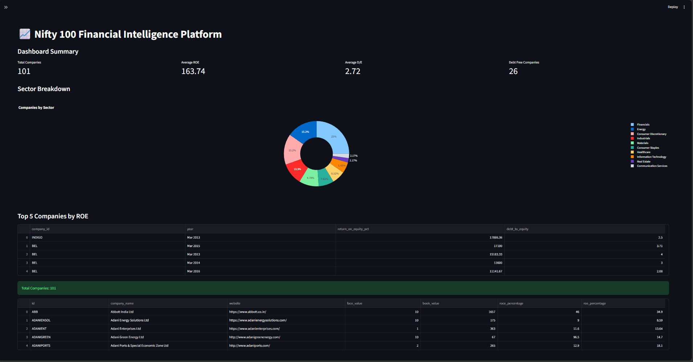
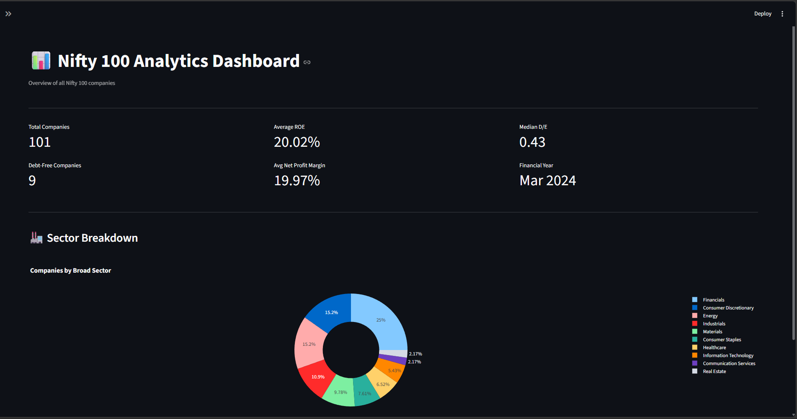

# 📈 Nifty 100 Financial Intelligence Platform

A Streamlit-based Financial Analytics Dashboard for Nifty 100 companies that provides company analysis, stock screening, peer comparison, trend analysis, sector insights, capital allocation visualization, annual reports, and valuation analytics.

---

# Features

- 📊 Home Dashboard
- 🏢 Company Profile
- 🔍 Stock Screener
- 🤝 Peer Comparison
- 📈 Trend Analysis
- 🏭 Sector Analysis
- 💰 Capital Allocation Map
- 📑 Annual Reports
- 📊 Valuation Analytics

---

# Tech Stack

- Python
- Streamlit
- Pandas
- Plotly
- SQLite
- OpenPyXL

---

# Project Structure

```
nifty100-platform
│
├── data/
│   ├── raw/
│   └── supporting/
│
├── output/
│
├── src/
│   ├── analytics/
│   └── dashboard/
│
├── screenshots/
│
├── README.md
└── requirements.txt
```

---

# Installation

```bash
git clone <repository-url>

cd nifty100-platform

pip install -r requirements.txt
```

---

# Run Dashboard

```bash
streamlit run src/dashboard/app.py
```

---

# Run Valuation Module

```bash
python src/analytics/valuation.py
```

---

# Generated Outputs

The valuation module generates:

- output/valuation_summary.xlsx
- output/valuation_flags.csv

---

# Dashboard Screens

- Home Dashboard
- Company Profile
- Stock Screener
- Peer Comparison
- Trend Analysis
- Sector Analysis
- Capital Allocation Map
- Annual Reports

---

# Screenshots

## Dashboard



## Home



## Company Profile


## Stock Screener


## Peer Comparison


## Trend Analysis


## Sector Analysis


## Capital Allocation Map


## Company Reports


---

# Sprint 4 Deliverables

- ✅ Streamlit Dashboard
- ✅ 8 Dashboard Screens
- ✅ Cached Database Layer
- ✅ Valuation Module
- ✅ Valuation Summary Export
- ✅ Valuation Flags Export

---

# Author

**Shashank Charpe**

MCA | Java Backend Developer | Python | Data Analytics